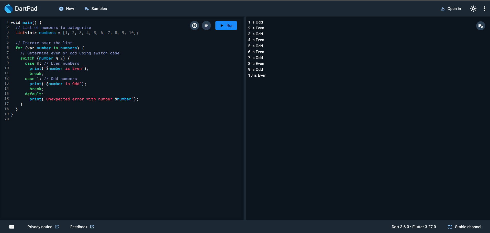

# Categorize Numbers into Even or Odd

## Description
This Dart program takes a list of numbers and categorizes them into even or odd using a `for` loop and `switch-case` statement.

## How to Run
1. Clone the repository or copy the `NumberCategorizer.dart` file to your local system.
2. Navigate to the project directory in your terminal.
3. Run the program using the following command:
   ```bash
   dart run NumberCategorizer.dart

## Example Output


## Explanation
- The program iterates through a list of numbers.
- Each number is checked for evenness or oddness using the modulus operator `%` and a `switch-case` statement.
